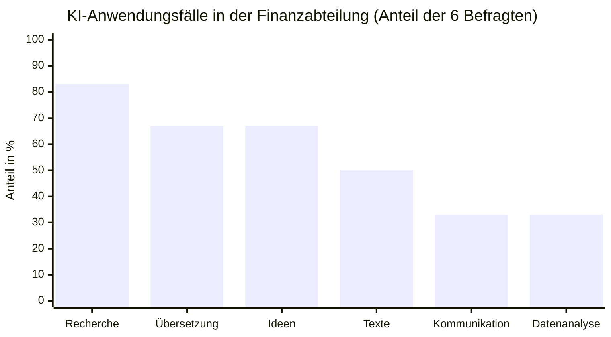

# Anwendungsfälle nach Häufigkeit

> **Kernaussage**: Recherche & Zusammenfassen ist mit Abstand der häufigste KI-Anwendungsfall (83 %), gefolgt von Übersetzungen und Ideen (je 67 %). Das zeigt, wo der Lern- und Hilfebedarf am größten ist.

## Grafik

### Werte als Tabelle

| Anwendungsfall | Nennungen | Anteil |
|---|:---:|:---:|
| Recherche & Zusammenfassen | 5 | 83 % |
| Übersetzungen | 4 | 67 % |
| Ideen & Brainstorming | 4 | 67 % |
| Texte schreiben / überarbeiten | 3 | 50 % |
| Kommunikation / E-Mail | 2 | 33 % |
| Datenanalyse / Auswertung | 2 | 33 % |

## Interpretation

Die Top-3-Anwendungsfälle sind sprach- und recherchelastig – genau hier sind KI-Textgeneratoren am stärksten. Datenanalyse wird bereits genutzt (33 %), obwohl der Wissensstand dort gering ist – ein Bereich mit besonderem Hinweisbedarf zum Datenschutz.

*Datenquelle: Umfrage KI-Nutzung, Finanzabteilung, Juni 2026 (n=6)*
