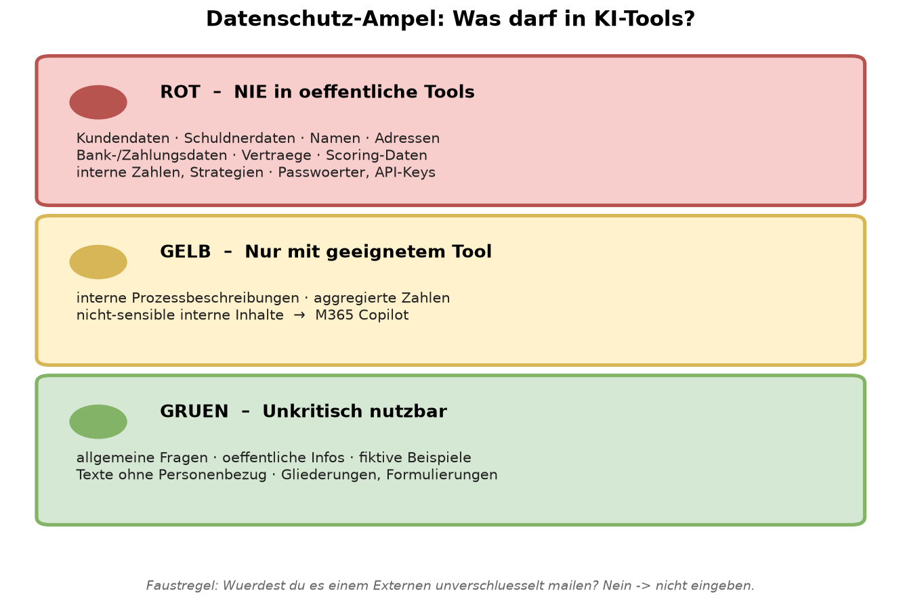
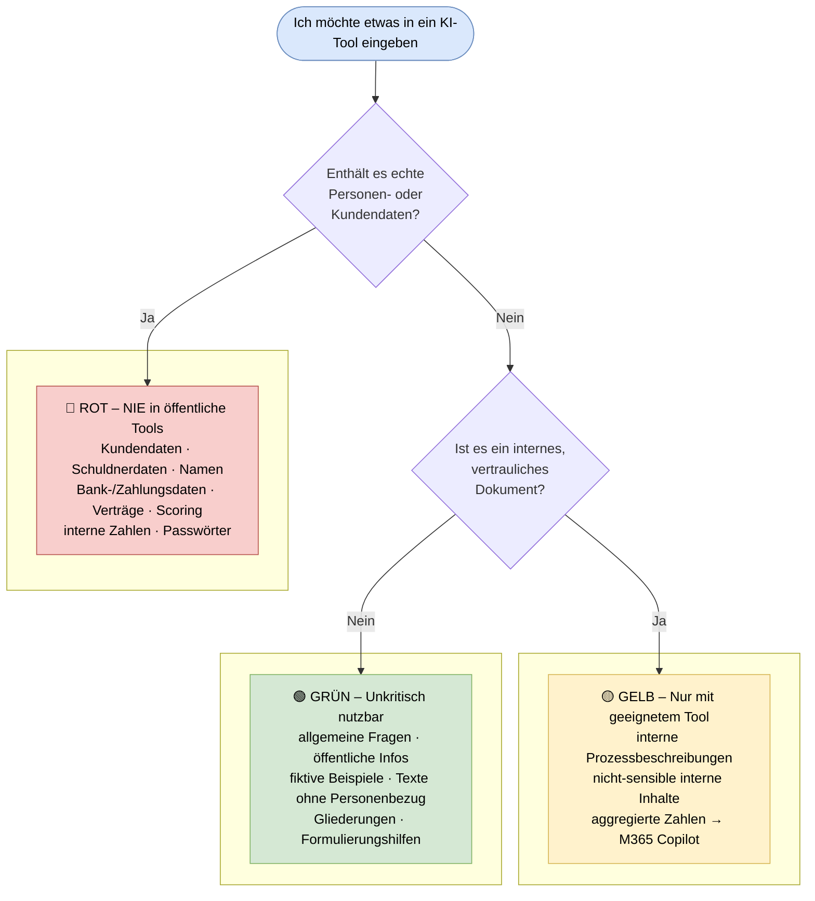

# Datenschutz-Ampel: Was darf in KI-Tools?

> **Kernaussage**: Diese Ampel hilft Mitarbeitenden, in Sekunden zu entscheiden, welche Inhalte in öffentliche KI-Tools dürfen – und welche nie. Datenschutz war die größte Hürde in der Umfrage (3 von 6 Nennungen).

## Grafik

Mermaid-Version (interaktiv in VS Code/GitHub)

## Interpretation

Die meisten Alltagsaufgaben (Formulieren, Zusammenfassen, Ideen) fallen in den grünen Bereich – sofern Platzhalter statt echter Daten verwendet werden. Der rote Bereich umfasst alle für EOS als Finanzdienstleister besonders schützenswerten Datenkategorien.

> 🧭 **Faustregel:** Würdest du es einem externen Dienstleister unverschlüsselt mailen? Nein → nicht eingeben.

*Datenquelle: Umfrage KI-Nutzung, Finanzabteilung, Juni 2026 (n=6) · Datenkategorien: ki-datenschutz-guide.md*
