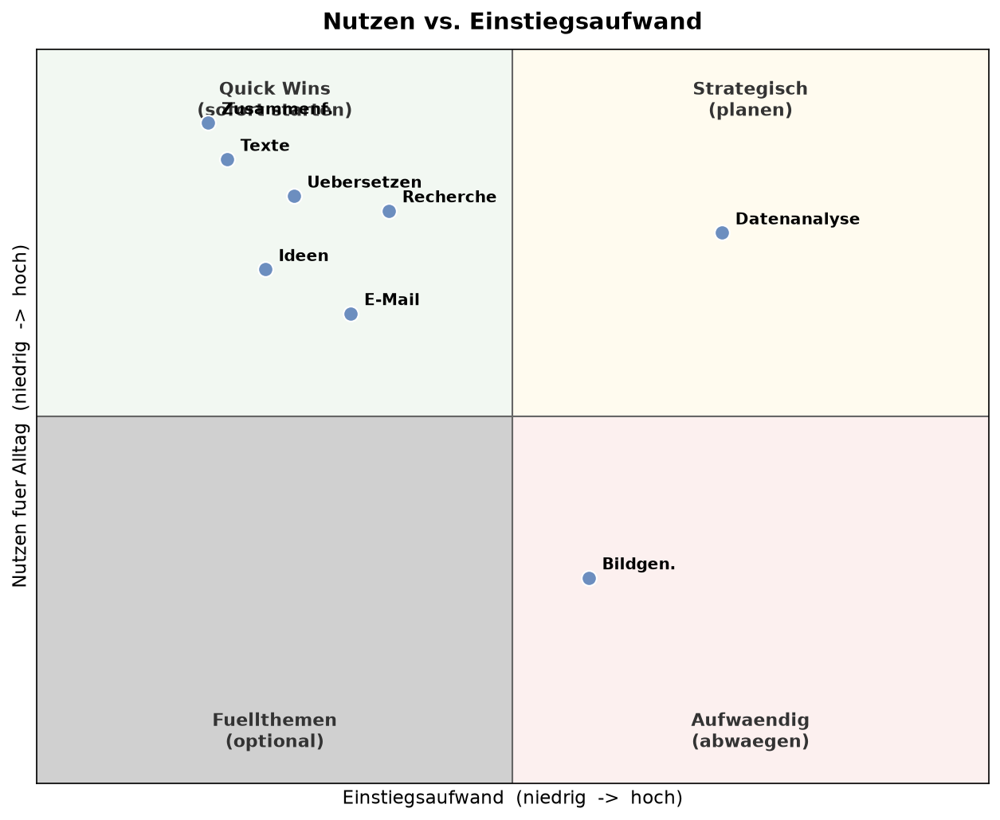
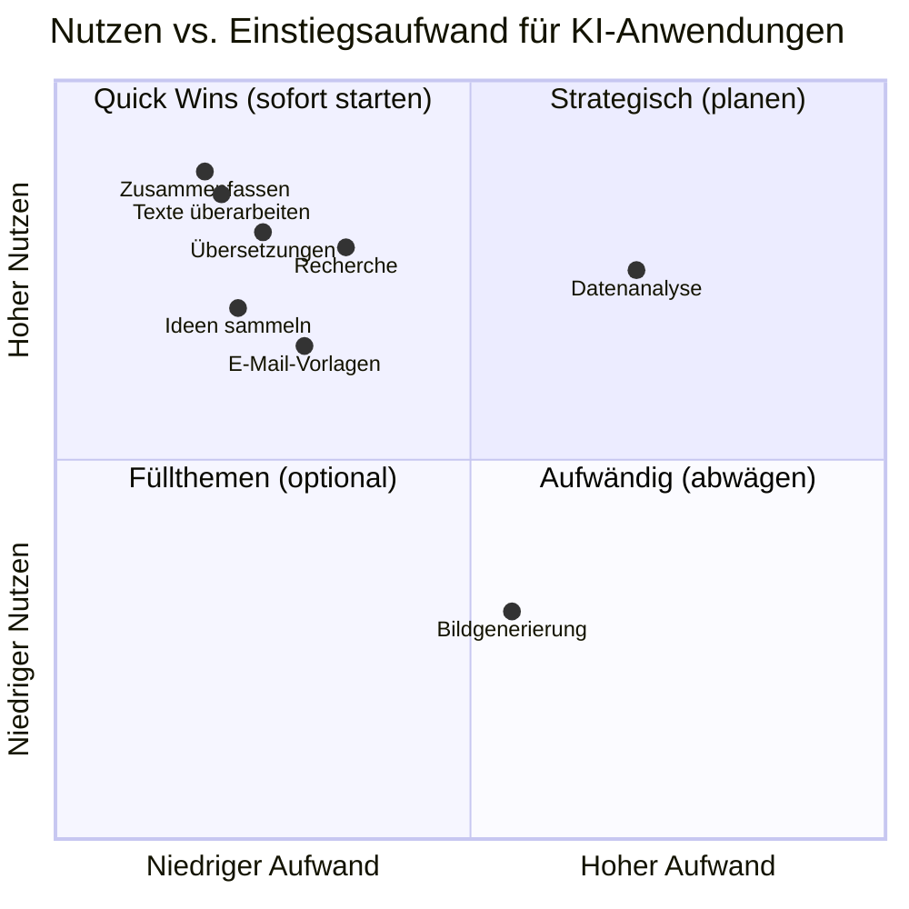

# Priorisierungsmatrix: Nutzen × Einstiegsaufwand

> **Kernaussage**: KI-Anwendungen lassen sich nach Nutzen für den Alltag und Einstiegsaufwand einordnen. „Quick Wins" (hoher Nutzen, niedriger Aufwand) sind ideale Startpunkte – z. B. Texte überarbeiten und Zusammenfassen.

## Grafik

Mermaid-Version (interaktiv in VS Code/GitHub)

### Einordnung

| Quadrant | Anwendungen | Empfehlung |
|---|---|---|
| 🟢 **Quick Wins** | Texte überarbeiten, Zusammenfassen, Übersetzungen, Ideen, Recherche | Sofort starten – höchster Nutzen, geringster Aufwand |
| 🟡 **Strategisch** | Datenanalyse | Lohnt sich, braucht aber Sorgfalt (Datenschutz!) |
| ⚪ **Füllthemen** | Bildgenerierung | Optional, im Finanzkontext selten relevant |

## Interpretation

Der Großteil der in der Umfrage genannten Anwendungsfälle sind **Quick Wins**: hoher Alltagsnutzen bei geringem Einstiegsaufwand. Hier sollte der Einstieg erfolgen. Datenanalyse bietet hohen Nutzen, erfordert aber wegen echter Daten besondere Datenschutz-Vorsicht.

*Datenquelle: Umfrage KI-Nutzung, Finanzabteilung, Juni 2026 (n=6) · Einordnung: fachliche Einschätzung*
